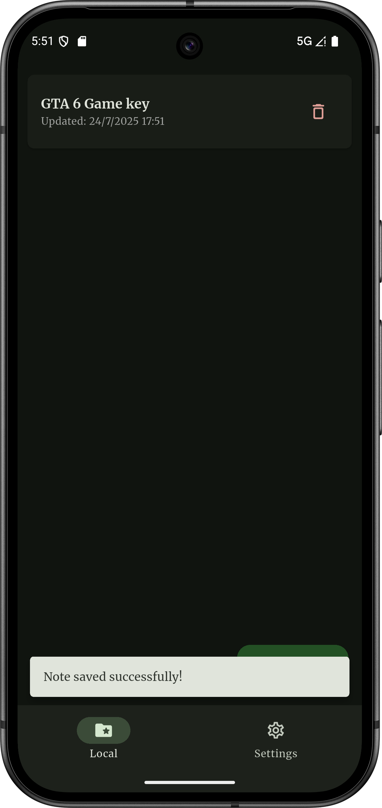
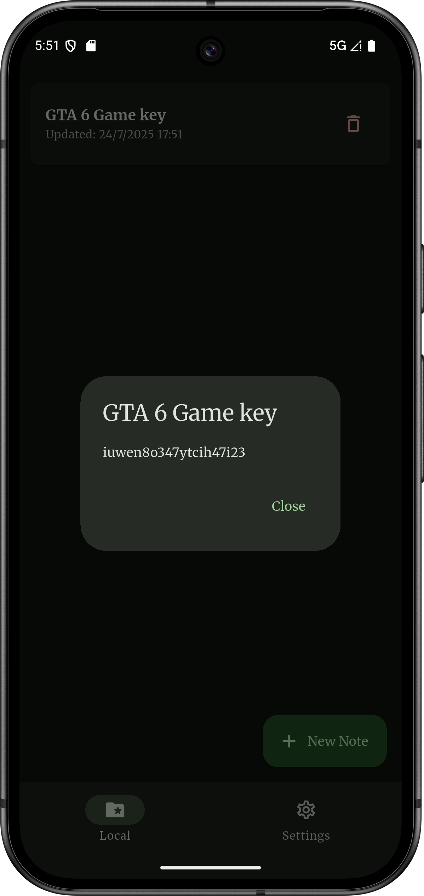

> [!WARNING]
> The project is still under unstable development. Expect bugs and breaking changes
<div align="left">

</div>
Nots is an open-source note-taking app designed primarly for Android, with privacy, simplicity, and customization in mind.  
It will later on feature self-hosted encrypted storage and colorful themes.

This branch will focus on the online encrypted storage system and other experimental upcoming features. Once a feature will be relatively stable, I will automatically update the master branch and release a build.

## Features
- [x] Basic stored notes
- [ ] Dark / light themes
- [ ] Material 3 colorful themes
- [ ] Online self-host server
- [ ] Encrypted storing (local/online)
- [ ] Note Sharing

If you want to experiment unreleased new features, check out the [dev_branch](https://github.com/TenebrisOS/Nots/tree/dev)
      
## Platforms Support
- [x] Android
- [ ] iOS (less probable)
- [ ] Web
- [ ] Linux / Windows

## Galery
<div align="left">



</div>

## Contributions
Contributions are highly encouraged and welcome. Please feel free to submit issues, pull requests, or discuss ideas. For further discussion, contact deftonish@proton.me

## Donations
- If you wish to help supporting my work, consider donating, small funds are always so caring.
- Bitcoin : ```bc1qfxg9wg97vklzselnayy0eutk5t9cpy048jmzzf```
- Ethereum : ```0x859477061053a5a6a72466fee128fbdff21a34ba```
- Solana : ```UDyMrbQh5LTBXAT3K22jRZCfnLpw4CwztiYcXBtvd4t```

## License
This project is licensed under the [GNU General Public License v3.0](LICENSE).

## Credits
This project was created and been mantained by [TenebrisOS](https://github.com/TenebrisOS)
